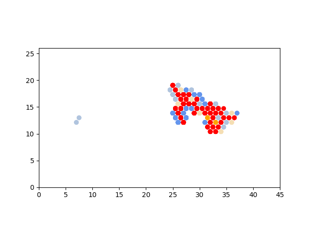
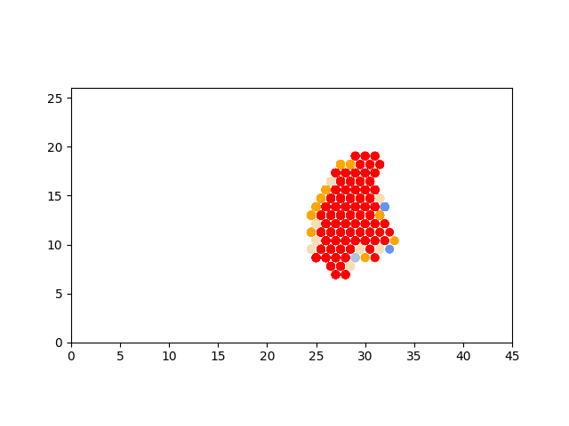
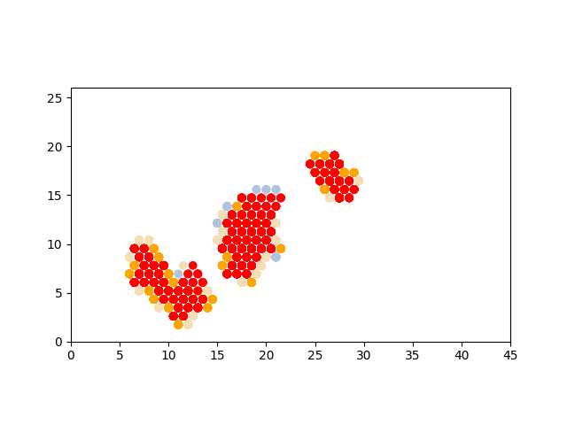
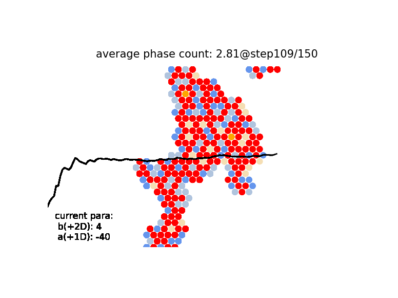
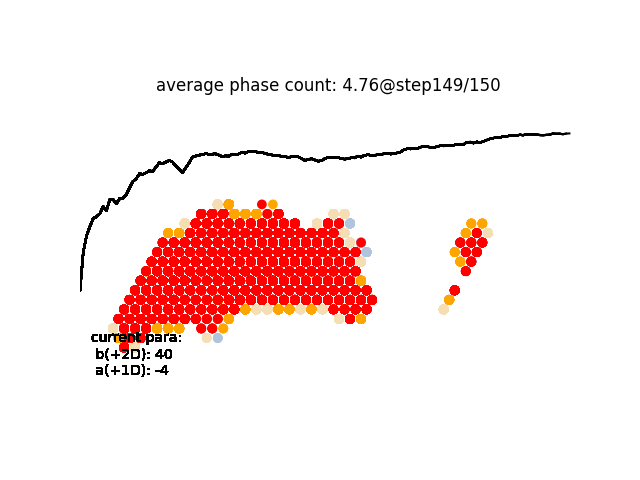

# hex-struct-order-dist

六角蜂窝结构的二维晶体中的有序无序相变。
程序描述了两种效应相互竞争的过程，在无序的体系中，晶化过程可能会有不同的pattern，两个可以调节的参数展示了它们如何控制不同图样的生成方式。

## 一维生长趋势
a=4, b=-40

## 二维生长趋势
a=40, b=-4

## 多个点生长
a=4, b=-2

## 一些统计性质的工作

